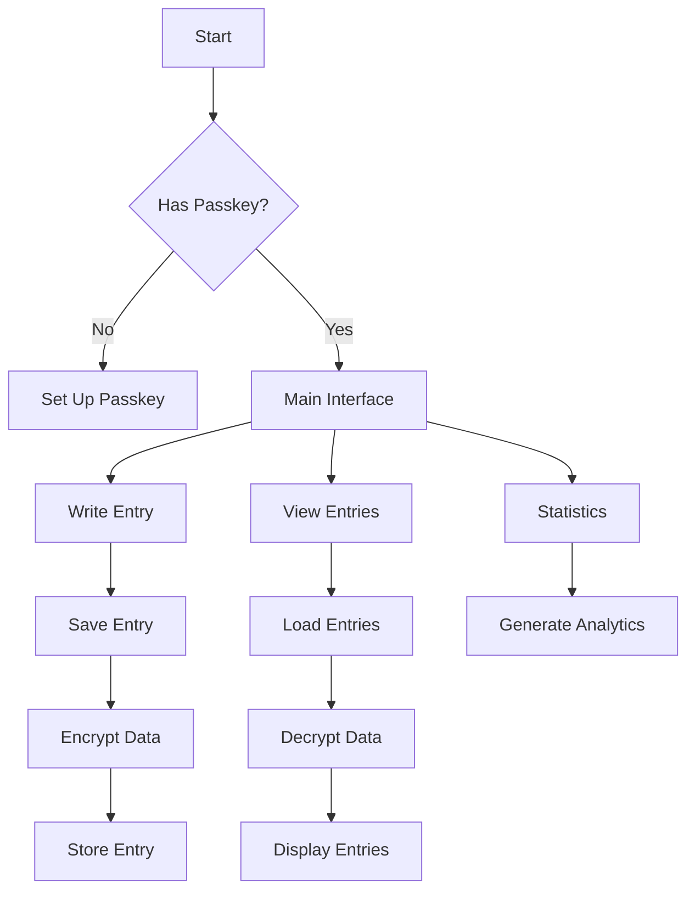
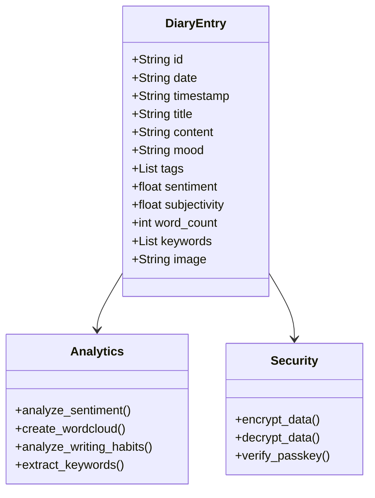
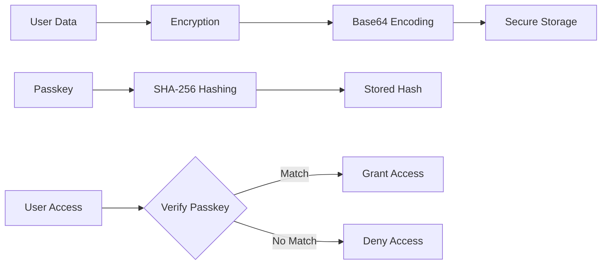
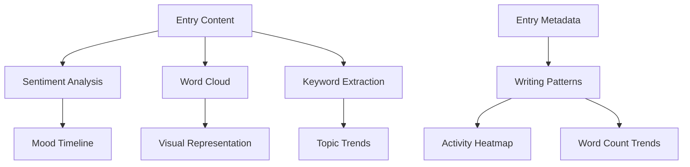

# 📔 Advanced Personal Diary

A modern, feature-rich personal diary application built with Streamlit, offering a secure and intuitive way to document your thoughts and experiences.


## ✨ Features

### 📝 Rich Text Editing
- **Markdown Support**: Write entries using Markdown formatting
  - Bold, italic, headings
  - Code blocks
  - Lists (bullet points and numbered)
  - Links
- **Real-time Preview**: See your formatted text as you type

### 🔒 Security
- **Passkey Protection**: Secure your entries with a personal passkey
- **Encryption**: All entries are encrypted before storage
- **Access Control**: Edit and delete operations require passkey verification

### 📊 Analytics Dashboard
- **Mood Tracking**: Visual representation of your emotional journey
- **Writing Patterns**: 
  - Most active days and hours
  - Word count trends
  - Sentiment analysis
- **Content Analysis**: 
  - Word clouds
  - Top keywords
  - Topic distribution

### 🖼️ Media Support
- **Image Attachments**: Add images to your entries
- **PDF Export**: Download beautifully formatted entries as PDF
- **Responsive Design**: Works on desktop and mobile devices

### 🏷️ Organization
- **Tags**: Categorize entries with custom tags
- **Search**: Find entries by content, tags, or date
- **Filtering**: Sort and filter entries based on various criteria

## 🔄 Application Flow



## 💾 Data Structure



## 🛠️ Technical Stack

- **Frontend**: Streamlit
- **Data Processing**: 
  - Pandas (data manipulation)
  - TextBlob (sentiment analysis)
  - WordCloud (text visualization)
- **Visualization**: 
  - Plotly (interactive charts)
  - Matplotlib (static plots)
- **PDF Generation**: ReportLab
- **Security**: 
  - Base64 (encryption)
  - SHA-256 (passkey hashing)

## 📦 Installation

1. Clone the repository:
```bash
git clone https://github.com/muzaffar401/Advance_Personal_Diary.git
cd Advance_Personal_Diary
```

2. Create a virtual environment:
```bash
python -m venv .venv
source .venv/bin/activate  # On Windows: .venv\Scripts\activate
```

3. Install dependencies:
```bash
pip install -r requirements.txt
```

4. Run the application:
```bash
streamlit run main.py
```

## 🚀 Getting Started

1. **First Launch**: Set up your passkey when prompted
2. **Writing Entries**: 
   - Click "Write Entry" in the sidebar
   - Fill in the title, content, mood, and tags
   - Optionally add an image
   - Click "Save Entry"
3. **Viewing Entries**:
   - Navigate to "View Entries"
   - Use the interactive table to sort and filter
   - Click on entries to view full content
4. **Analytics**:
   - Check the "Statistics" page for insights
   - View mood trends, writing patterns, and word clouds

## 🔐 Security Features

The application implements several security measures:



## 🎨 Markdown Support

Your entries can be formatted using Markdown:

```markdown
# Main Heading
## Subheading
**Bold text**
*Italic text*
- Bullet point
1. Numbered list
`code block`
```

## 📊 Analytics Features

The application provides rich analytics:



## 🤝 Contributing

Contributions are welcome! Please feel free to submit a Pull Request.

## 📄 License

This project is licensed under the MIT License - see the LICENSE file for details.

## 🙏 Acknowledgments

- Streamlit for the amazing framework
- TextBlob for sentiment analysis
- ReportLab for PDF generation
- All contributors and users of this project

---
Made with ❤️ for personal journaling
